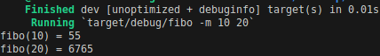

# SE202 Rust - Fibonacci Sequence
This repository aims to show a little of the Rust course I followed in my master 1 programme, as part of the Embedded Systems study track I chose. Here it's possible to find a Rust programme for computing Fibonacci sequence values through different methods in order to compare their performances. 

- At the moment of this commit, we have the following methods already implemented:
    - Iterative
    - Recursive

## Meta
 * **Master in Electrical Engineering - Institut Polytechnique de Paris**
 * **Course:** SE202 Rust
 * **Author:** Alaf DO NASCIMENTO SANTOS
 * **License**: [MIT](LICENSE)
 * **Year:** 2023

## Installing Rust
If you are using a Linux machine, the following command would be enough: ***curl --proto '=https' --tlsv1.2 -sSf https://sh.rustup.rs | sh***
For more information, please take a look at the Rust official website: https://www.rust-lang.org/tools/install

## How to compile and execute the project?
After installing cargo, you can use the command ***cargo build***, which compiles the project.

For running a Rust programme, you can use the command line ***cargo run***, but in this project you must give some arguments to the loader in order to run the binary. 

When you only want to see the value of the Nth position in the Fibonacci sequence, in other words fibo(N), the only thing you need to pass to the loader is the N value as an argument.
For example, considering N = 20, you should type this in your terminal: ***cargo run 20***.  The expected output is given in the image below. Basically, the programme gave us the first and the final value in the sequence from 0 up to N (20).

In case you don't want to start computing from 0, for example from 10 to 20, you must type the ***cargo run -- -m 10 20***. The output would be something similar to:

## How to Contribute to the Project
- Any implementation that could lead to a more automatic function call for the different methods already designed without recompiling would be a nice improvement for this project. 
- New methods for computing the Fibonacci Sequence, as well as their logic flow, are always welcome.

So feel free to fork, change, and pull request 😊